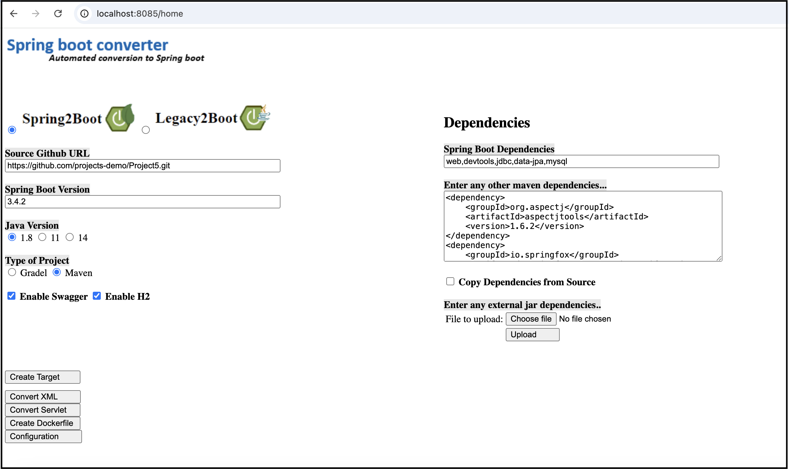

# Java Web Application Migration to Spring Boot

## 📌 Overview

This Spring2Boot Engine automates the migration of Java web applications (both **Maven-based** and **Traditional**) to a **Spring Boot** project structure. It clones a given Git repository, extracts the necessary files, and organizes them into the appropriate **Spring Boot directory structure**.

**Supported OS**: Windows, Linux, macOS

### 🚀 Features

- **Spring Boot Project Creation** (Supports both **Maven-based** and **Traditional** web applications)
- **XML to Java Config Conversion** (e.g., `web.xml`, `bean definition.xml`, `hibernate.cfg.xml`, `persistence.xml`, `JPA mappings`)
- **Servlet to Controller Conversion** (`doGet()` → `@GetMapping`, `doPost()` → `@PostMapping`)
- **UI Configuration Setup**

## 🏠 Home Screen Wireframe

Below is the wireframe for the home screen:



---

## 📂 Local Setup

### Grant Access to Eclipse for Local Working Directory

Grant **full disk access** to Eclipse:

1. **Go to** `Settings` → `Privacy & Security`
2. **Navigate to** `Full Disk Access`
3. **Click** `+` and add **Eclipse** to the list.


### Generate ANTLR Java Files Using Grammar

1. Navigate to:
   ```sh
   /Users/saurabhgupta/eclipse-workspace/text-processing-libraries-modules
   ```
2. Copy all generated Java files and **libraries** to the **Spring Boot migration project**.

### Set Up Maven and Build

Ensure Maven is installed and configured correctly:

```sh
export PATH=$PATH:/Users/saurabhgupta/Downloads/apache-maven-3.9.0/bin
mvn package
```

### Set the Staging Area Path in Admin Configuration

```sh
/Users/saurabhgupta/Downloads/springproject1
```

---

## 📁 Project Structure

### 📌 Maven-Based Web Application

```
my-webapp/
├── src/
│   ├── main/
│   │   ├── java/com/example/      (Java files)
│   │   ├── resources/             (Config files, properties, etc.)
│   │   ├── webapp/                (JSPs, web.xml, static resources)
│   │       ├── WEB-INF/
│   │           ├── web.xml
│   │           ├── views/
│   │           ├── lib/
│   │           ├── classes/
```

### 📌 Traditional (Non-Maven) Java Web Application

```
my-webapp/
├── src/com/example/     (Java files)
├── WebContent/          (JSPs, HTML, CSS, JS)
│   ├── WEB-INF/
│   │   ├── web.xml
```

---

## 🚀 Migration Script Usage

To execute the migration script, use the following sample command:

```sh
# Sample script for Legacy project migration
/bin/bash /Users/saurabhgupta/Downloads/springproject1/migration_script.sh https://github.com/Safnaj/Java-Web-Application.git Java-Web-Application "web,devtools,jdbc,data-jpa,mysql" 3.4.2 1.8 maven-project my-project /Users/saurabhgupta/Downloads/springproject1/ null hbm2entitypom.xml legacy2boot
```

```sh
# Sample script for Spring project migration
/bin/bash /Users/saurabhgupta/Downloads/springproject1/migration_script.sh https://github.com/projects-demo/Project5.git Project5 "web,devtools,jdbc,data-jpa,mysql" 3.4.2 1.8 maven-project my-project /Users/saurabhgupta/Downloads/springproject1/ null hbm2entitypom.xml spring2boot
```

### 📌 Parameters

| **Parameter**            | **Description**                                       |
|-------------------------|-----------------------------------------------------|
| `git_project_url`       | URL of the Git repository to clone                    | 
| `project_name`          | Name of the project being migrated                    |
| `dependencies`          | List of dependencies for the Spring Boot project      |
| `bootVersion`          | Spring Boot version to use                            |
| `javaVersion`          | Java version for the project                          |
| `typeProject`          | Type of project (Maven, Gradle, etc.)                 |
| `targetProjectDirectory` | Destination directory for the migrated project        |
| `basePath`             | Base path where projects are located                   |
| `listOfFiles`          | List of specific files to migrate (if applicable)      |
| `migrationType`        | Type of migration (`legacy2boot`, `spring2boot`)       |

---

## 📜 Migration Rules

The migration script follows a set of predefined **rules** to properly migrate files from a traditional Java web project to a **Spring Boot** project.

| Rule  | Description  | Applies to |
|-------|-------------|------------|
| **R1** | Modifies the `pom.xml` file by adding necessary dependencies. | **Maven Projects** |
| **R2** | Moves library files (`lib/`) to `src/main/resources/lib/`. | **Both Maven & Traditional** |
| **R3** | Copies `hbm2entitypom.xml` to the target project directory. | **Both Maven & Traditional** |
| **R4** | Transfers Java source files while handling different structures. | **Both Maven & Traditional** |
| **R5** | Moves `WebContent` files appropriately (`src/main/resources/` or `WebContent/`). | **Both Maven & Traditional** |
| **R6** | Ensures JSPs and static assets are correctly placed. | **Maven Projects** |
| **R7** | Cleans up `WEB-INF/` structure post-migration. | **Both Maven & Traditional** |

---

## 🚀 Running the Application

### Start the Migration Engine

Run the migration engine:

```sh
java -jar EngineSpring2Boot.java
```

### Access the Application

After running the migration script, access the application at:

```
http://localhost:8085/home
```

### Configure and Execute Migration

1. Navigate to **Admin Configuration**.
2. Set your preferred values.
3. Select the **transformation type** (`Legacy2Boot` or `Spring2Boot`).
4. Fill in other fields as necessary.
5. Click **Create Target** to generate the Spring Boot project skeleton.

---

## 📌 Notes & Recommendations

- Ensure **Maven is properly installed** before running the migration script.
- Make sure your **Git repository URL** is accessible.
- **Check logs** if the migration fails due to missing dependencies.
- After migration, **manually review converted Java configurations** for accuracy.

---


Happy coding! 🚀
